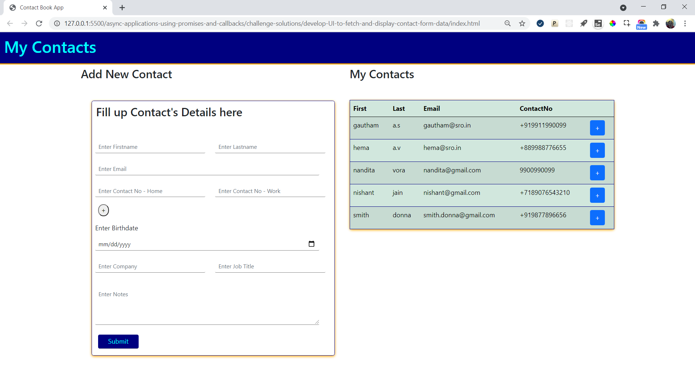
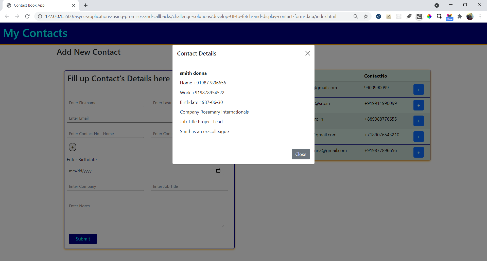

## Practice Challenge

### Develop UI to Fetch and Display Contact Form Data

#### Context

Prime Solutions is an IT solutions provider company who have earned reputation in providing IT solutions in different business domains

Recently they have received a project to develop contact book app.

Prime Solutions have approached Graffitti designers for a good UI design.

The design is ready and now it needs to be made functional.

The development will be carried out in stages.

In the first two stages, inputs are captured, validated and posted to server.

In the third stage of development, you as a frontend developer have to fetch the data and display it on UI

##### Contact Form

Graffitti Designers have designed contact form that allows app users to provide inputs

#### Challenge

The contact form currently has fields that captures basic contact details.

However, more fields can be added going forward

For a lengthy form, it would not be recommended to display entire details of a contact on the page.

Instead for a cleaner UI, it would be better to display the key details such as name, email and one of the contact nos.

More details can be provided when user opts for it.

Hence, the UI should be accordingly developed and populated.

#### Problem Statement

Fetch the details stored from contacts.json file through json-server

Display the key details, such as 

- FirstName
- LastName
- Email
- Home Contact No

The contact list should be arranged in the alphabetical order by the firstname

The contact list should be displayed in tabular format as suggested below:

More contact details should be displayed in a modal view, once the + button is clicked, as suggested below.

#### Instructions

1. Fork the boilerplate
2. Clone the forked repository
3. Provide the solution code inside the script file `contact_service.js`.
4. Ensure JavaScript Promise is used to make asynchronous calls.
5. Develop your own axios to return promise with response
4. The validation code can be reused from previous challenge and can be kept in `script.js`
5. Ensure no other codes get modified, else, the rendering logic will fail to generate desired output.
6. Launch the `index.html` page on the browser to view the rendered output
7. To store contacts `contacts.json` should be created and put under a separate folder outside the application folder
8. Command to run json-server is:
`json-server -w contacts.json`
